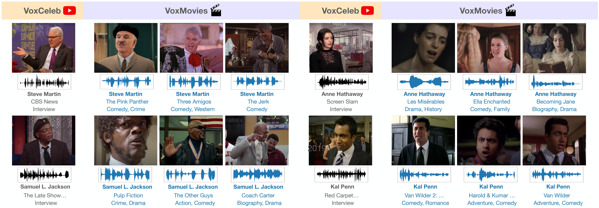

# VoxMovies

This repository contains evaluation script for VoxMovies dataset.



[project_page](https://www.robots.ox.ac.uk/~vgg/data/voxmovies/) [arxiv_paper](https://arxiv.org/abs/2010.15716)


### Dependencies
```
pip install -r requirements.txt
```

### Dataset and test pairs
- VoxMovies dataset and test pairs can be downloaded from [here](https://drive.google.com/file/d/1K-CSOE3IJyhaq--wkj1RhZIMND4qdgri/view?usp=sharing).
- For e2, e3 and e4 test pairs, you also need both VoxCeleb1 dev and test set. Please download them from [here](https://www.robots.ox.ac.uk/~vgg/data/voxceleb/vox1.html).

### Evaluation
- You need to aggregate VoxCeleb1 and VoxMovies into *args.test_path*. We've used symlink for this.
- Please note that directory PATH_TO_VOXCELEB needs to contain both VoxCeleb1 dev & test wavfiles.

```
mkdir data
cd data
ln -s PATH_TO_VOXCELEB1 voxceleb1
ln -s PATH_TO_VOXMOVIES_TEST_SET voxmovies_test
```

Then, run the script below.
```python
python eval.py --initial_model PATH_TO_PRETRAINED_MODEL --test_list PATH_TO_TEST_PAIRS --test_path data/
```

### Pretrained models
- Both pretrained model and finetuned model are provided below.
- Note that baseline_v2_ap.model is publicly available. Please refer to [here](https://github.com/clovaai/voxceleb_trainer) for more details about model architecture and training procedures.

**Evaluation results (EER %) with VoxMovies test sets**
|       Test pairs      |  e1  |  e2  |  e3  |  e4  |   e5  |
|:--------------------:|:----:|:----:|:----:|:----:|:-----:|
| [baseline_v2_ap.model](http://www.robots.ox.ac.uk/~joon/data/baseline_v2_ap.model) | 6.09 | 7.40 | 7.50 | 9.23 | 10.47 |
|    [finetuned.model](https://drive.google.com/file/d/1QVKn7U4u01uDWTinxGmpnkWoqVOFDY4U/view?usp=sharing)   | 5.76 | 7.10 | 8.36 | 7.37 |  9.55 |

### Citation
If you make use of this code, kindly reference:
```
@InProceedings{Brown21b,
    title={Playing a Part: Speaker Verification at the Movies},
    author={Andrew Brown and Jaesung Huh and Arsha Nagrani and Joon Son Chung and Andrew Zisserman},
    year={2021},
    booktitle={International Conference on Acoustics, Speech, and Signal Processing (ICASSP)}
}
```
